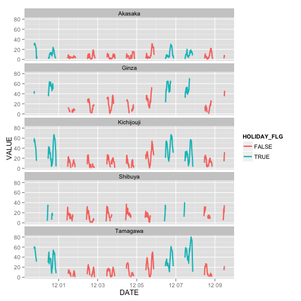
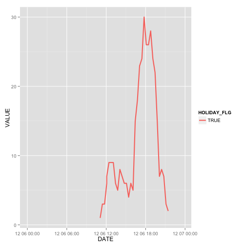

美登利寿司は赤坂の15時くらいがおすすめ 
===

美登利寿司に行きたいのですが, 行列は嫌です. 

どこに何時に行けばいいかを調べました. 

10日分くらいの行列長さデータを作りました. 


```r
library(data.table)
library(dplyr)
library(ggplot2)
```

[行列の長さデータ](https://github.com/gghatano/midori_sushi)を可視化します. 


```r
dat = fread("~/works/midori/data.dat.tmp", header=FALSE)
dat %>% setnames(c("MONTH", "DAY", "HOUR", "MIN", "SHOP", "VALUE"))
shop_vec = c("Kichijouji", "Shibuya", "Tamagawa", "Akasaka", "Ginza")
dat_shop = 
  dat %>% 
  group_by(SHOP) %>% 
  summarise(TMP = 1) %>% 
  group_by(add=FALSE) %>% 
  mutate(ID = shop_vec) %>% 
  select(-TMP)
dat_shop
```

```
## Source: local data table [5 x 2]
## 
##             SHOP         ID
## 1 アトレ吉祥寺店 Kichijouji
## 2         渋谷店    Shibuya
## 3         玉川店   Tamagawa
## 4         赤坂店    Akasaka
## 5         銀座店      Ginza
```

```r
dat_holiday = 
  dat %>% select(MONTH,DAY) %>% 
  group_by(MONTH,DAY) %>%
  summarise(n = n()) %>% 
  select(-n) %>% 
  group_by(add=FALSE) %>% 
  mutate(HOLIDAY_FLG = c(T,T,F,F,F,F,F,T,T,F,F))

dat_modified = 
  merge(dat, dat_shop, by="SHOP") %>% 
  merge(., dat_holiday, by=c("MONTH", "DAY")) %>% 
  mutate(DATE = paste("2014", MONTH,DAY, sep="-")) %>% 
  mutate(TIME = paste(HOUR, MIN, sep=":")) %>% 
  mutate(DATE = paste(DATE, TIME)) %>% 
  mutate(DATE = as.POSIXct(DATE))  
```

## 系列5店舗の様子

```r
dat_modified %>% 
  ggplot() +
  facet_wrap(~ID, nrow=5) +
  geom_line(aes(x=DATE, y=VALUE, colour=HOLIDAY_FLG), size = 1)
```

 


赤坂の行列が短そうなので, 赤坂に行きます. 

## 赤坂店

```r
dat_modified %>% filter(ID == "Akasaka") %>% 
  filter(MONTH == 12, DAY == 6) %>% 
  ggplot() +
  #facet_wrap(~ID, nrow=5) +
  geom_line(aes(x=DATE, y=VALUE, colour=HOLIDAY_FLG), size = 1)
```

```
## Warning: Removed 80 rows containing missing values (geom_path).
```

 

15時くらいが良さそうですね!


